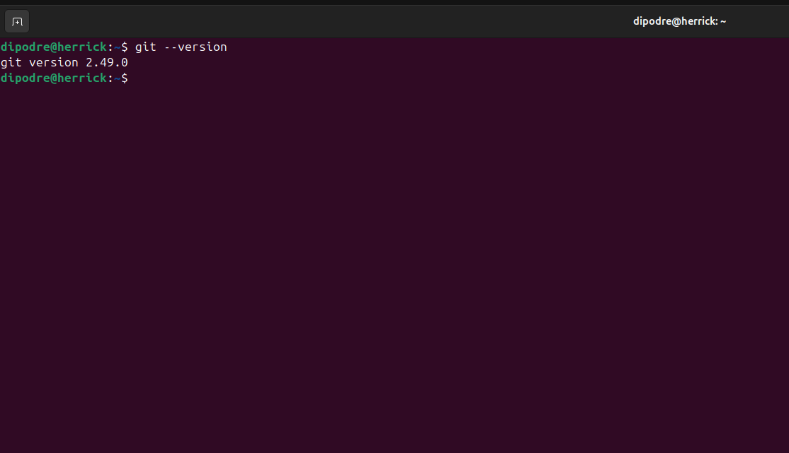
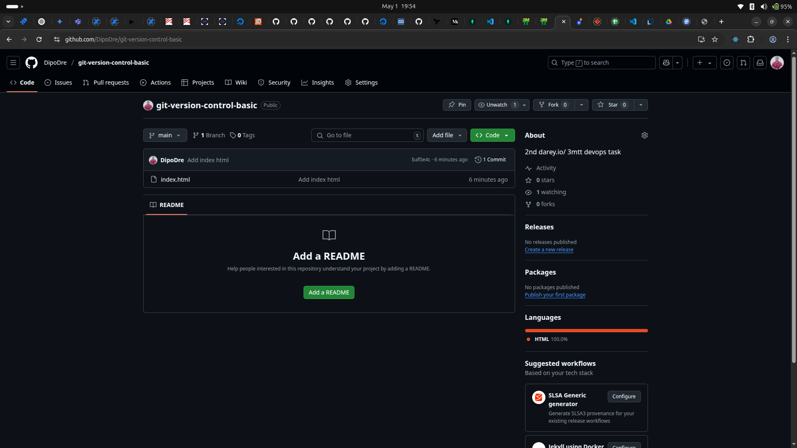
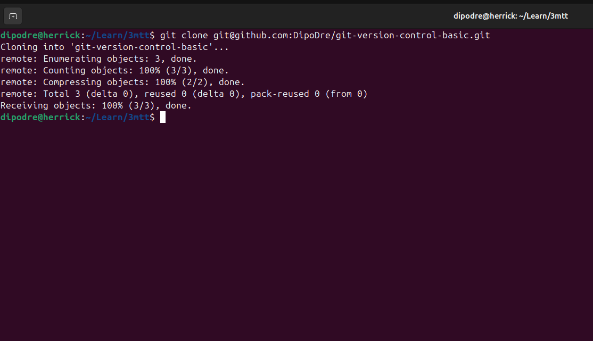
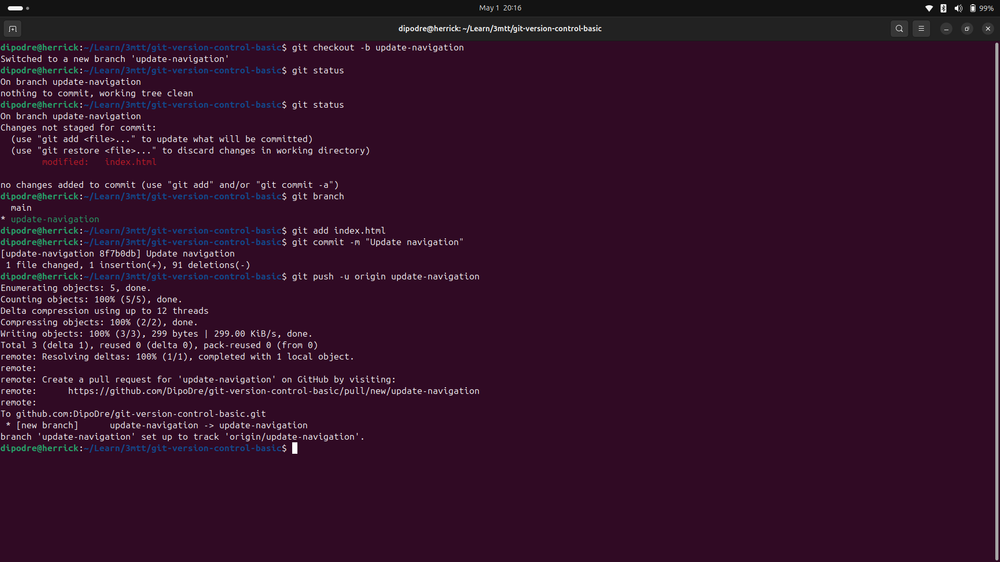
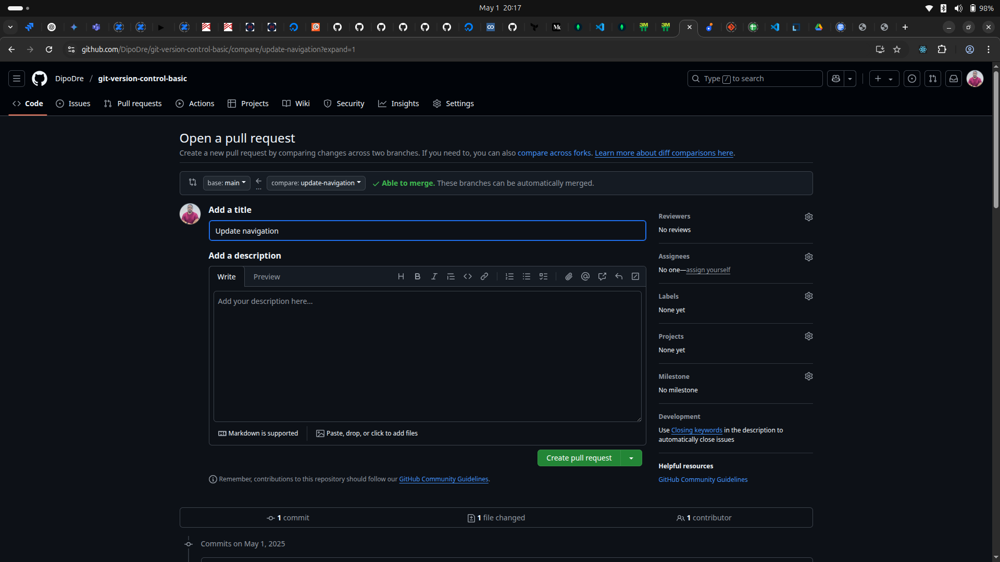
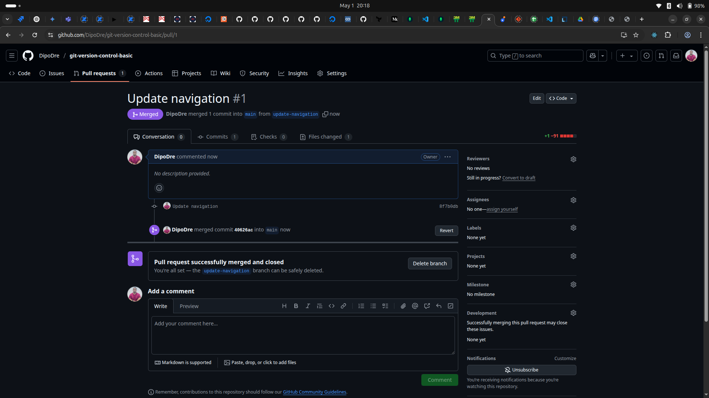
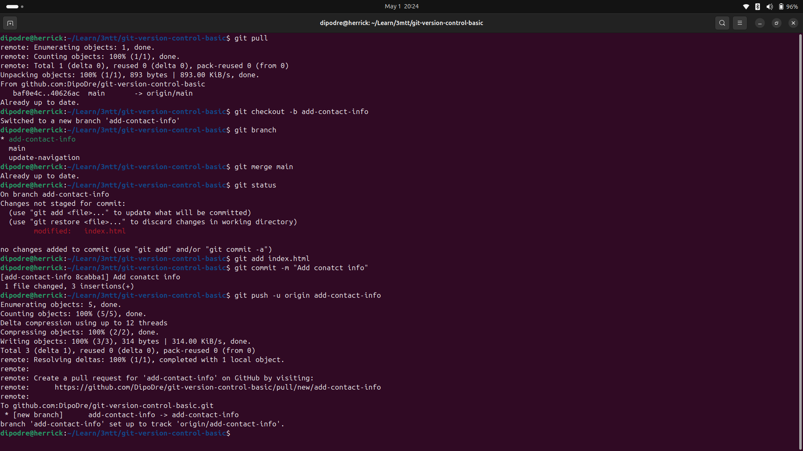
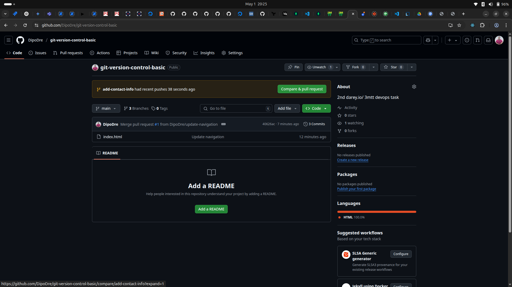

<!-- ABOUT THE PROJECT -->
## GIT VERSION CONTROL BASIC

### Objective

For this project, the following steps were taken to demonstrate git version control basics:

- [GIT VERSION CONTROL BASIC](#git-version-control-basic)
  - [Objective](#objective)
    - [Initial Set Up](#initial-set-up)
    - [Branch Creation and Updates](#branch-creation-and-updates)
    - [Making and Merging Changes](#making-and-merging-changes)

----

#### Initial Set Up

Install git and clone the project repository from a central repository on GitHub.

----

#### Branch Creation and Updates

Branches are created on the local repository.

----

#### Making and Merging Changes

Changes are made to the index.html file in both update-navigation and add-contact-info branches. The changes are staged and committed. Pull requests are made and merged to the remote repository.

